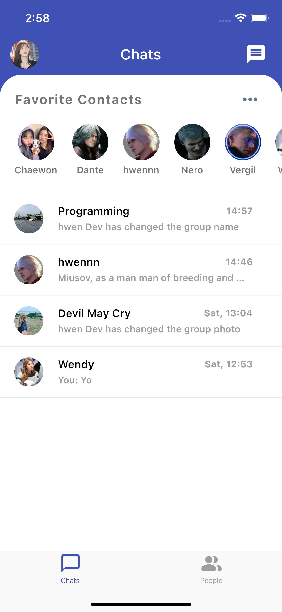
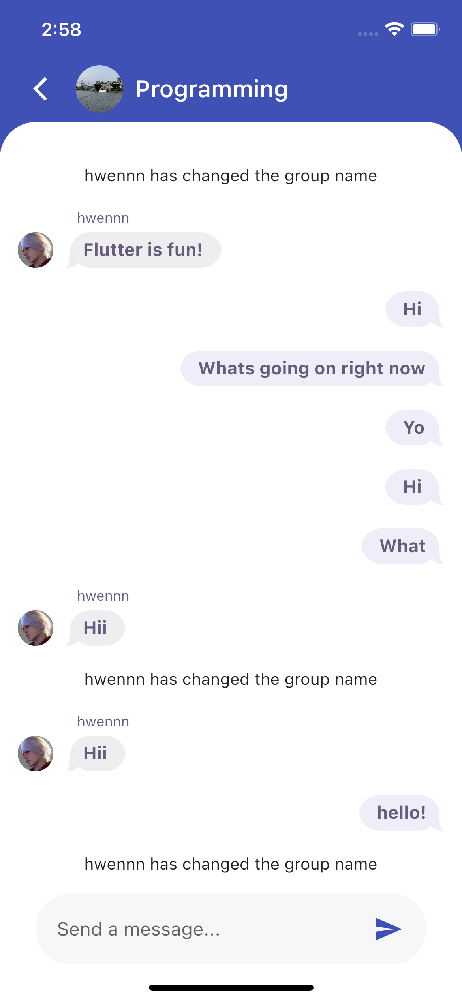

# PogHouse

A minimalistic chat app made by Flutter and Firebase.

## Description
* A chat app made by Flutter and Firebase.
* Support login with google and facebook account
* Chat with any user, send text, update group info, setting favorite contacts.

## Screenshots
Chat Home            |  Message Screen
:-------------------------:|:-------------------------:
  |  

## Built With
- [Cloud firestore](https://firebase.flutter.dev/docs/overview) - Used for cloud database
- [Firebase Auth](https://firebase.google.com/docs/auth) - Used for user authentication
- [Cloud Storage](https://firebase.google.com/docs/storage) - Used to store images

## Dependencies used
- [provider](https://pub.dev/packages/provider)
- [uuid](https://pub.dev/packages/uuid)
- [rxdart](https://pub.dev/packages/rxdart)
- [cached_network_image](https://pub.dev/packages/cached_network_image)
- [image_picker](https://pub.dev/packages/image_picker)
- [adaptive_action_sheet](https://pub.dev/packages/adaptive_action_sheet)
- [flutter_dialogs](https://pub.dev/packages/flutter_dialogs)
- [flutter_easyloading](https://pub.dev/packages/flutter_easyloading)
- [shimmer](https://pub.dev/packages/shimmer)

## How to run
* Clone this repo
* Run `flutter packages get`
* Run `flutter run` (remember open simulator or connect physical device, iOS auto run additional command `pod install`)

## Credits

<table>
  <tr>
    <td align="center"><a href="https://github.com/hwennnn"> <b>Hou Man</b></a> 
    </td>
  </tr>
</table>

## Contribute

We would love you for the contribution to **Countdown**, any issue or pull requrest is welcomed.

